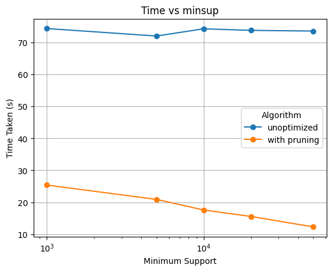
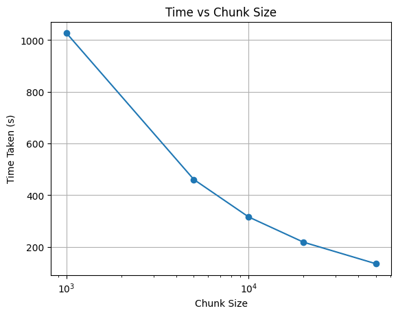
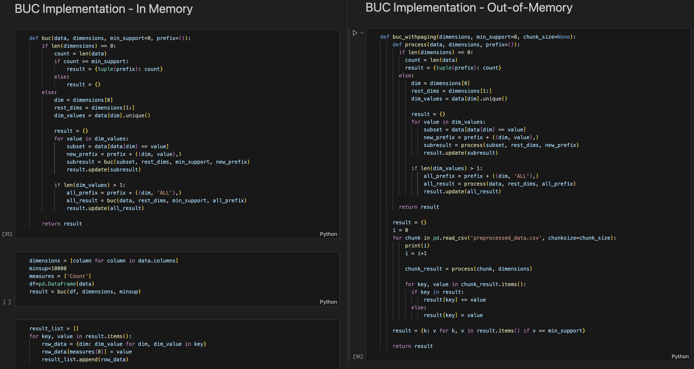

# Data Analytics 
# Assignment 2 : TEAM - 3
# BUC Algorithm and Attribute Oriented Induction
```
Abhinav Reddy Boddu - 2021101034
Gowlapalli Rohit - 2021101113
```
## Performance Analysis

### A plot of minsup vs. runtime, keeping allotted memory fixed


The plot shows the run times for calculating unoptimized versus pruned bottom-up cube (BUC) computations at varying minimum support levels. 

- **Unoptimized BUC**: The blue line represents the unoptimized algorithm, where the run time remains relatively constant around 70 seconds across different values of minimum support. This indicates that the unoptimized algorithm's performance is not significantly affected by changes in minimum support.

- **Pruned BUC**: The orange line represents the BUC algorithm with pruning. The trend shows a noticeable decrease in run time as the minimum support increases. This suggests that pruning effectively reduces computation time by eliminating branches in the computation that do not meet the minimum support, leading to faster execution.

- **Overall Comparison**: The pruned algorithm consistently outperforms the unoptimized version in terms of run time, especially as the minimum support threshold increases. This demonstrates the efficiency gains achieved through pruning, particularly in scenarios with higher minimum support values.

### A plot of allotted memory vs. runtime, keeping minsup fixed


#### Observation:
The plot shows a consistent decrease in processing time as chunk size increases.

#### Interpretation:
- **Reduced Overhead:** Larger chunk sizes reduce the number of chunks, lowering overhead in management and processing.
- **Improved Efficiency:** Larger chunks may enable more efficient data processing, possibly through vectorization or parallelism.
- **No Significant Bottlenecks:** The steady downward trend suggests no major bottlenecks limiting the benefits of larger chunk sizes.

#### Conclusion:
Increasing chunk size consistently improves performance in this scenario, likely due to task nature, hardware, or algorithm efficiency. However, this conclusion may not apply universally.


## Optimization Technique (30 marks)

The optimization implemented in the `buc_pruning` function involves **pruning branches** of the computation tree that cannot meet the specified `min_support`, thereby reducing unnecessary computations.

#### Details of the Optimization:

1. **Pruning Based on Minimum Support:**
   - **Unoptimized `buc`:** Recursively processes all possible combinations of dimension values, regardless of their counts.
   - **Optimized `buc_pruning`:** Before making a recursive call for a subset, it checks if the count of data points in that subset is greater than or equal to `min_support`.
     - If the count is less, the recursive call is skipped.
     - This check is applied to both individual dimension values and the 'ALL' aggregate.

2. **Reduced Recursive Calls:**
   - By skipping subsets with counts below `min_support`, the algorithm avoids diving deeper into branches that won't contribute to the final result.
   - This leads to a smaller recursion tree and fewer function calls.

#### Impact on Performance:

- **Decreased Execution Time:**
  - **Fewer Computations:** Pruning reduces the number of subsets the algorithm needs to evaluate.
  - **Efficiency Gains:** Resources are focused on processing only meaningful subsets, improving overall efficiency.
  
- **Scalability Improvements:**
  - **Handling Larger Datasets:** The optimized algorithm scales better with larger datasets and higher dimensionality.
  - **Better Performance with Higher `min_support`:** As `min_support` increases, more branches are pruned, leading to greater performance gains.

- **Resource Optimization:**
  - **Memory Usage:** Reduced recursion depth can lower memory consumption.
  - **Processing Power:** Less computational power is required due to fewer operations.

#### Summary:

The optimization in `buc_pruning` enhances performance by:

- **Eliminating Unnecessary Computations:** Skips processing of subsets that cannot meet the `min_support`.
- **Improving Efficiency:** Focuses on relevant data, making the algorithm faster and more resource-effective.
- **Scaling Effectively:** Performs better with larger datasets and higher minimum support thresholds compared to the unoptimized version.


## Comparison of BUC and AOI

## 1. Primary Purposes and Use Cases

### Bottom-Up Cube (BUC) Algorithm
- **Purpose**: 
  - The BUC algorithm is primarily used for computing data cubes in OLAP (Online Analytical Processing) systems. It is designed to efficiently compute and materialize aggregate measures (like sums, counts, averages) for different combinations of dimensions in a data cube.
  
- **Use Cases**:
  - **Data Aggregation**: BUC is widely used in scenarios where it is necessary to explore aggregated data across multiple dimensions, such as sales data aggregated by region, time, and product category.
  - **Data Warehousing**: BUC is applied in data warehousing environments to preprocess data for fast retrieval during OLAP queries.
  - **Efficient Computation**: The algorithm is particularly useful when the dataset is sparse or when only a subset of the cube needs to be computed, allowing for significant computational savings.

### Attribute-Oriented Induction (AOI)
- **Purpose**: 
  - AOI is a data mining technique aimed at generalizing data by replacing specific attribute values with higher-level concepts. It is primarily used for data reduction, concept description, and generating conceptual hierarchies.
  
- **Use Cases**:
  - **Data Generalization**: AOI is often used in applications where summarization of data is required, such as in the creation of high-level knowledge from detailed transactional data.
  - **Concept Description**: It is useful in situations where it is important to discover and describe general trends or patterns in the data, often applied in classification tasks.
  - **Data Preprocessing**: AOI can be used as a preprocessing step in data mining to reduce the complexity of the data by abstracting and summarizing it, making it easier to apply other data mining techniques.

### Key Differences

| Aspect                         | BUC Algorithm                                          | Attribute-Oriented Induction (AOI)                  |
|--------------------------------|--------------------------------------------------------|-----------------------------------------------------|
| **Focus**                      | Aggregating and materializing data cubes               | Generalizing and summarizing data                   |
| **Approach**                   | Bottom-up computation of aggregates for data cubes     | Top-down generalization of attribute values         |
| **Computation**                | Prunes unnecessary branches to optimize cube computation | Uses concept hierarchies to replace specific values with general terms |
| **Output**                     | A multi-dimensional array of aggregated data points    | A higher-level, abstracted view of the original data |
| **Application Domain**         | OLAP, data warehousing, multi-dimensional data analysis | Data mining, knowledge discovery, data reduction    |
| **Handling of Data**           | Deals with multi-dimensional, often sparse data        | Handles detailed transactional data, abstracts it into higher-level concepts |
| **Efficiency**                 | More efficient with sparse data                        | Efficiency depends on the availability of well-defined concept hierarchies |


## 2. Types of Insights or Patterns Best Suited for Discovery

### Bottom-Up Cube (BUC) Algorithm
- **Types of Insights**:
  - **Aggregated Trends**: BUC is well-suited for discovering patterns related to aggregate measures across multiple dimensions. For example, it can reveal trends such as the total sales by region and time period, or the average profit margin by product category.
  - **Dimensional Relationships**: The algorithm is effective in identifying relationships and dependencies between different dimensions. For instance, it can show how sales performance varies when viewed across different regions and product lines simultaneously.
  - **Anomalies and Outliers**: By computing aggregate data at different levels, BUC can help in spotting anomalies or outliers that deviate from typical patterns, such as unexpectedly low sales in a specific region or time period.

- **Best Suited For**:
  - **Multi-dimensional Analysis**: BUC excels in environments where multi-dimensional data needs to be explored, and detailed, quantitative analysis is required across different axes of data.
  - **Operational Decision Making**: The insights derived from BUC are valuable for operational decisions, such as adjusting inventory levels based on sales performance across different stores.

### Attribute-Oriented Induction (AOI)
- **Types of Insights**:
  - **Generalized Patterns**: AOI is best suited for discovering generalized patterns by abstracting data into higher-level concepts. For example, it can identify that "senior citizens" generally prefer certain product categories over "young adults" without focusing on individual transactions.
  - **Conceptual Trends**: AOI can reveal broader trends and conceptual relationships within the data, such as a general increase in consumer spending with age, or a preference for certain product types in urban areas compared to rural areas.
  - **Summarization**: It provides high-level summaries of the data, making it easier to understand complex datasets by reducing them to their essential components. For example, summarizing customer demographics by income level rather than by exact income.

- **Best Suited For**:
  - **Knowledge Discovery**: AOI is particularly useful in knowledge discovery tasks where the goal is to extract broad patterns and trends that can inform strategic decisions, such as understanding market segments.
  - **Data Simplification**: AOI is ideal for scenarios where data needs to be simplified and generalized, making it more comprehensible and easier to communicate to non-technical stakeholders.


## 3. Computational Efficiency and Scalability

### Bottom-Up Cube (BUC) Algorithm
- **Computational Efficiency**:
  - **Selective Aggregation**: BUC improves efficiency by selectively computing only the necessary aggregates, particularly in sparse datasets. It prunes branches of the computation tree where further aggregation is not needed, reducing the number of operations.
  
- **Scalability**
  - **Scalability in Dataset size**: BUC is scalable to large datasets, particularly when the data is sparse. Its ability to prune unneeded computations makes it more efficient than other methods in scenarios with high dimensionality and sparsity. However, for dense datasets with many non-empty cells, the computational cost can be high.

- **Strengths**:
  - **Efficient Handling of Sparse Data**: BUC is optimized for cases where not all combinations of dimensions are populated, which is common in large, multi-dimensional datasets.
  - **Multi-dimensional Scalability**: The algorithm scales well with an increasing number of dimensions, as it avoids unnecessary computations, making it suitable for high-dimensional data cubes.

- **Weaknesses**:
  - **Computationally Intensive in Dense Data**: When dealing with dense datasets, BUC may not offer significant computational savings, leading to higher processing times and memory usage.
  - **Increased Complexity with Dimensionality**: While scalable, the complexity of managing and optimizing BUC increases as the number of dimensions grows.

### Attribute-Oriented Induction (AOI)
- **Computational Efficiency**:
  - **Concept Hierarchies**: AOI uses pre-defined concept hierarchies to generalize and reduce data, which can make the process computationally efficient. By abstracting data at higher levels, it reduces the number of data points and operations required.
  - **Data Reduction**: The generalization process in AOI inherently reduces the volume of data, which can lead to faster processing and more efficient computation, particularly in large datasets with many attributes.

- **Scalability**:
  - **Scalability in Data Size**: AOI is scalable in terms of data size because it reduces the dataset by generalizing specific values into broader categories, which decreases the amount of data that needs to be processed.
  - **Limitations with High Dimensionality**: While AOI is effective at reducing data size, its scalability can be limited when dealing with a very high number of attributes or when the concept hierarchies are not well-defined. The process may require significant preprocessing to establish these hierarchies.

- **Strengths**:
  - **Efficient Data Reduction**: AOI is highly efficient when it comes to reducing and simplifying large datasets, making it ideal for summarization tasks.
  - **Scalable Generalization**: The method scales well with increasing data volume, as generalization naturally reduces the number of instances to be processed.

- **Weaknesses**:
  - **Dependency on Concept Hierarchies**: The efficiency and scalability of AOI are heavily dependent on the availability and quality of predefined concept hierarchies. Poorly defined hierarchies can lead to less efficient processing.
  - **Limited in Handling Raw, High-Dimensional Data**: AOI may struggle with raw, high-dimensional data if adequate concept hierarchies are not available, requiring additional steps to preprocess and structure the data.


## 4. Interpretability of Results

### Bottom-Up Cube (BUC) Algorithm
- **Interpretability**:
  - **Structured Aggregates**: The results produced by BUC are highly structured and organized into multi-dimensional data cubes. Each cell in the cube represents a specific aggregate measure (e.g., sum, average) for a combination of dimensions. This structured format makes it relatively straightforward for users to interpret the results, as they can directly see how different dimensions (e.g., time, location, product category) interact.
  - **Detailed and Granular Insights**: BUC provides granular insights into the data, allowing users to drill down into specific combinations of dimensions. For example, a user can easily interpret sales performance by region and month, then drill down further to individual products.
  - **Complexity in High Dimensions**: While the structured format aids interpretability, the results can become overwhelming and complex to interpret as the number of dimensions increases, especially if the data cube is dense. Users might need tools like OLAP cubes or visualization software to effectively explore and understand the data.

- **Strengths**:
  - **Clear and Direct Aggregates**: The results are clear and directly tied to specific combinations of dimensions, making them easy to interpret for users familiar with the data structure.
  - **Support for Drill-Down Analysis**: Users can easily perform drill-downs to explore data at various levels of granularity, enhancing the interpretability of detailed insights.

- **Weaknesses**:
  - **Potential Overload of Information**: As the number of dimensions grows, the results can become complex and harder to interpret without proper tools.
  - **Dependence on User Familiarity**: Users need to have some familiarity with multi-dimensional data analysis to fully interpret the results.

### Attribute-Oriented Induction (AOI)
- **Interpretability**:
  - **Abstract and Generalized Insights**: AOI produces results that are more abstract and generalized compared to BUC. The method reduces the data to higher-level concepts, making the results easier to interpret at a strategic level. For example, AOI might summarize a customer base by general income levels rather than individual incomes, providing a broader understanding of customer demographics.
  - **Simplified Summaries**: The generalization process in AOI leads to simplified summaries that are often easier to interpret, particularly for non-technical stakeholders. These summaries highlight broader patterns and trends without overwhelming the user with excessive detail.
  - **Conceptual Clarity**: By focusing on higher-level concepts, AOI results are often more interpretable in terms of understanding overall trends and relationships within the data. However, this abstraction can sometimes obscure the underlying details, making it less suitable for tasks that require detailed, granular insights.

- **Strengths**:
  - **High-Level Summarization**: The results are typically presented in a way that is easy to understand, even for those without deep technical expertise, making AOI effective for communicating insights to broader audiences.
  - **Conceptual Patterns**: AOI is particularly good at revealing and summarizing conceptual patterns, making it easier to grasp general trends and relationships.

- **Weaknesses**:
  - **Loss of Detail**: The abstraction process in AOI can lead to a loss of detail, which might make it harder to interpret specific, granular insights.
  - **Dependence on Concept Hierarchies**: The interpretability of AOI results depends on the quality and relevance of the concept hierarchies used. Poorly defined hierarchies can lead to misleading or overly generalized interpretations.


## 5. Scenarios Where One Method Might Be Preferable Over the Other

### Scenarios Favoring the Bottom-Up Cube (BUC) Algorithm
- **Multi-Dimensional Analysis in OLAP Systems**:
  - **Use Case**: BUC is ideal for scenarios where the primary goal is to perform in-depth multi-dimensional analysis, such as in Online Analytical Processing (OLAP) systems.
  - **Example**: A retail company wants to analyze sales performance across various dimensions, including time, region, product category, and customer segment. BUC can efficiently compute and aggregate this data, allowing the company to drill down into specific combinations to identify trends and anomalies.

- **Exploration of Detailed Data Aggregates**:
  - **Use Case**: When detailed and granular insights are required, BUC is preferable because it computes specific aggregates for every possible combination of dimensions.
  - **Example**: A financial analyst needs to explore detailed transaction data, aggregating it by date, transaction type, and customer profile. BUC provides the necessary level of detail, enabling the analyst to uncover precise patterns and correlations.

- **Handling Sparse Data**:
  - **Use Case**: BUC is particularly advantageous in scenarios where the data is sparse, and only a subset of the possible dimension combinations contains data.
  - **Example**: In a scenario where a company's sales data is sparse across multiple regions and product lines, BUC can efficiently compute the relevant aggregates without wasting resources on empty combinations.

### Scenarios Favoring Attribute-Oriented Induction (AOI)
- **High-Level Data Summarization and Conceptual Analysis**:
  - **Use Case**: AOI is preferable in scenarios where the objective is to gain a high-level summary of the data, reducing complexity and focusing on conceptual patterns.
  - **Example**: A marketing team wants to understand broad customer behavior trends, such as the general spending habits of different demographic groups. AOI can generalize the data into meaningful categories (e.g., "high-income," "middle-income") and provide insights into how these groups differ.

- **Knowledge Discovery and Pattern Recognition**:
  - **Use Case**: AOI is suitable for tasks involving knowledge discovery, where the goal is to identify general patterns and trends within large datasets.
  - **Example**: A healthcare researcher aims to identify general health trends across various populations. By using AOI, the researcher can generalize detailed health data into broader categories, making it easier to identify overarching patterns, such as the prevalence of certain conditions in specific age groups.

- **Simplifying Data for Non-Technical Audiences**:
  - **Use Case**: AOI is ideal when the results need to be communicated to non-technical stakeholders who require simplified and generalized insights rather than detailed technical analysis.
  - **Example**: A business executive needs to make strategic decisions based on broad trends in customer feedback. AOI can summarize this feedback into key themes (e.g., "positive," "neutral," "negative"), making it easier for the executive to understand and act upon.

- **Preprocessing for Further Data Mining**:
  - **Use Case**: AOI can serve as a preprocessing step for other data mining techniques, where generalizing the data helps to reduce its complexity and enhance the performance of subsequent analyses.
  - **Example**: Before applying a clustering algorithm to customer purchase data, AOI can be used to generalize purchase amounts and product categories, leading to more meaningful and interpretable clusters.

#### Summary
- **BUC** is preferable when detailed, multi-dimensional aggregation is needed, especially in sparse datasets or when performing OLAP tasks.
- **AOI** is more suitable for scenarios requiring high-level summaries, conceptual insights, and simplified data interpretation, particularly when communicating with non-technical audiences or as a preprocessing step for further analysis.


### Concrete Examples from Implementations

#### a. Primary Purposes and Use Cases
- **BUC Algorithm**:
  - *Example*: In the `iceberg_apriori` function, BUC aggregates data across dimensions like `Electric Vehicle Type`, `Electric Utility`, and `Model Year`, revealing patterns in vehicle sales.

- **AOI**:
  - *Example*: The `Generalizer` class categorizes data, e.g., `generalize_range` groups `Electric Range` into 'Short', 'Medium', and 'Long Range', aiding in understanding overall trends.

#### b. Types of Insights or Patterns
- **BUC**:
  - *Example*: `get_candidate_itemsets` finds frequent combinations, e.g., `BEV` vehicles with `Long Range` in specific regions, highlighting significant data patterns.

- **AOI**:
  - *Example*: By generalizing continuous values, e.g., `Electric Range`, AOI helps identify broader consumer preferences, such as a majority falling into the 'Medium Range' category.

#### c. Computational Efficiency and Scalability
- **BUC**:
  - *Example*: The `buc_pruning` technique skips itemsets below the minimum support, optimizing efficiency and reducing computation in large datasets.

- **AOI**:
  - *Example*: `remove_unused_fields` drops irrelevant columns, reducing dataset complexity, making generalization faster and more scalable.

#### d. Interpretability of Results
- **BUC**:
  - *Example*: BUC results, such as frequent itemsets of `BEV` and `Long Range`, are straightforward for business analysts to interpret and act upon.

- **AOI**:
  - *Example*: Simplifying `Electric Vehicle Type` into `BEV` and `PHEV` categories in AOI makes data easier to understand and communicate.

#### e. Scenarios for Preference
- **BUC**:
  - *Example*: Prefer BUC for detailed analysis, e.g., exploring popular combinations of vehicle type and range over different years.

- **AOI**:
  - *Example*: Choose AOI for identifying broad trends, such as general sales periods by categorizing `Model Year`.


